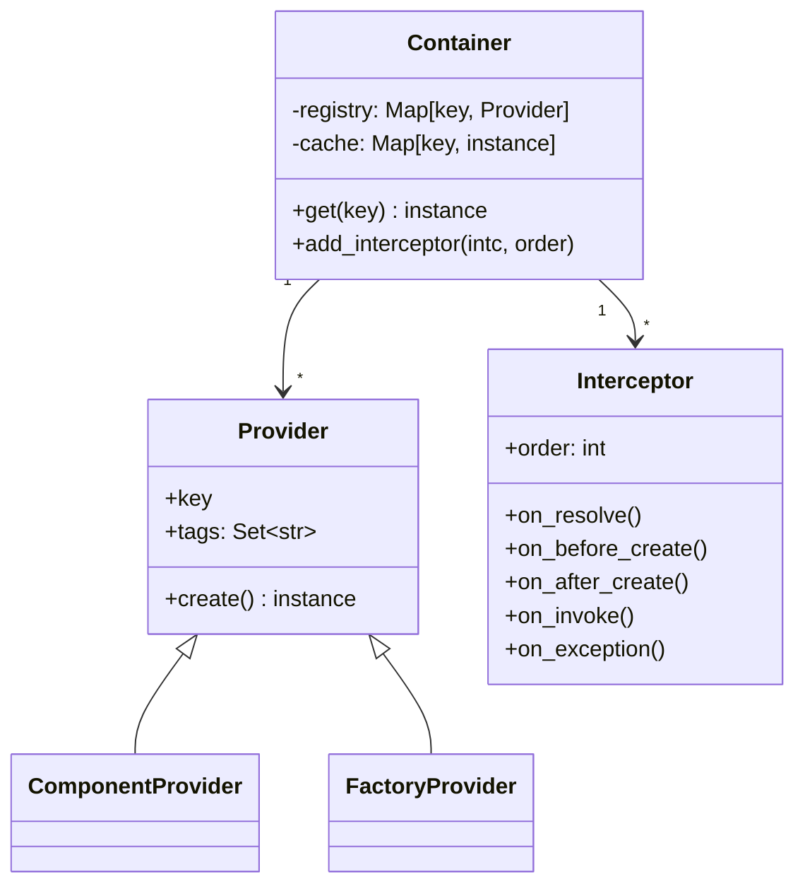

# pico-ioc — Architecture

> **Scope:** internal model, wiring algorithm, lifecycle, and design trade-offs.  
> **Non-goals:** tutorials/recipes (see `GUIDE.md`), product pitch (see `OVERVIEW.md`).

> ⚠️ **Requires Python 3.10+** (uses `typing.Annotated` with `include_extras=True`).

---

## 1) Design goals & non-goals

### Goals
- **Tiny, predictable DI** for Python apps (CLIs, Flask/FastAPI, services).
- **Fail fast** at bootstrap; deterministic resolution.
- **Ergonomic**: typed constructors; minimal reflection; explicit decorators.
- **Framework-agnostic**: no hard deps on web frameworks.
- **Safe by default**: thread/async-friendly; no global mutable singletons.

### Non-goals
- Full Spring feature set (complex scopes, bean post-processors).
- Hot reload or runtime graph mutation beyond explicit overrides.
- Magical filesystem-wide auto-imports.

---

## 2) High-level model

- **Component** → class marked with `@component`. Instantiated by the container.
- **Factory component** → class marked with `@factory_component`; owns provider methods via `@provides(key=TypeOrToken)`. Providers return *externals* (e.g., `Flask`, DB clients).
- **Container** → built by `pico_ioc.init(mod_or_list, ...)`; resolve with `container.get(KeyOrType)`.

### Bootstrap sequence (simplified)

```mermaid
sequenceDiagram
    participant App as Your package(s)
    participant IOC as pico-ioc Container
    App->>IOC: init([app, ...], overrides?, plugins?, interceptors?)
    IOC->>App: scan decorators (@component, @factory_component, @plugin)
    IOC->>IOC: register providers (key -> factory)
    IOC->>IOC: apply overrides (replace providers/constants)
    IOC->>IOC: validate graph (types, duplicates) and prepare caches
    App->>IOC: get(Service)
    IOC->>IOC: resolve dependencies (Repo, Config, ...)
    IOC-->>App: instance(Service)
````

---

## 3) Discovery & registration

1. **Scan inputs** passed to `init(...)`: module or list of modules/packages.
2. **Collect**:

   * `@component` classes → registered by **type** (the class itself).
   * `@factory_component` classes → introspected for `@provides(key=...)` methods.
   * `@plugin` classes → if explicitly passed via `init(..., plugins=(...))`.
3. **Registry** (frozen after bootstrap):

   * Map **key → provider**. Keys are typically **types**; string tokens are supported but discouraged.

**Invariant:** For each key there is **at most one active provider**; **last registration wins**.
This allows deterministic test overrides by ordering modules: `init([app, test_overrides])`.

---

## 4) Resolution algorithm (deterministic)

When constructing a component `C`:

1. Inspect `__init__(self, ...)`; collect **type-annotated** parameters (excluding `self`).
2. For each parameter `p: T` resolve by this order:

   1. **Exact type** `T`
   2. **MRO walk**: first registered base class or protocol
   3. **String key** (only if `@provides(key="token")` was used)
3. Instantiate dependencies depth-first; cache singletons.
4. Construct `C` with resolved instances.

### Failure modes

* **No provider** for a required key → **bootstrap error** (fail fast).
* **Ambiguous/incompatible** registrations → **bootstrap error** with a targeted hint.

### 4b) Collection resolution

If the constructor requests `list[T]` or `list[Annotated[T, Q]]`:

* Return **all** compatible providers for `T`.
* If `Q` (qualifier) is present, filter to matching ones.
* Registration order is preserved; no implicit sorting.
* Returns an empty list if no matches.

---

## 5) Lifecycles & scopes

* **Singleton per container**: a provider is instantiated at most once and cached.
* **Lazy proxies (optional)**: `@component(lazy=True)` defers instantiation until first use. Prefer eager to catch errors early.

**Rationale:** Most Python app composition (config, clients, web apps) fits singleton-per-container; it’s simple and fast.

---

## 6) Factories & providers

Use `@factory_component` for **externals** (framework apps, DB clients, engines):

```python
from pico_ioc import factory_component, provides
from flask import Flask

@factory_component
class AppFactory:
    @provides(key=Flask)
    def provide_flask(self) -> Flask:
        app = Flask(__name__)
        app.config["JSON_AS_ASCII"] = False
        return app
```

Guidelines:

* Providers should be **pure constructors** (no long-running work).
* Prefer **typed keys** (e.g., `Flask`) over strings.

---

## 7) Concurrency model

* Container state is **immutable after init**.
* Caches & resolution are **thread/async safe** (internal isolation; no global singletons).
* Instances you create **must** be safe for your usage patterns; the container cannot fix non-thread-safe libraries.

---

## 8) Error handling & diagnostics

* **Bootstrap**:

  * Missing providers → explicit error with parameter/type details.
  * Duplicate keys → last-wins policy; registration order is retained for debugging.
  * Type mismatch → precise error pointing to the offending `__init__` param.
* **Runtime**:

  * Exceptions from providers/constructors bubble with a **dependency chain** in the stack (key path).

**Tip:** Keep constructors **cheap**; push I/O to explicit start/serve methods.

---

## 9) Configuration

Treat config as a **component**:

```python
@component
class Config:
    WORKERS: int = int(os.getenv("WORKERS", "4"))
    DEBUG: bool = os.getenv("DEBUG", "0") == "1"
```

Inject `Config` where needed; avoid scattered `os.getenv` calls.

---

## 10) Overrides & composition

### 10.1 Module-ordered overrides

Place a test/alt provider module **after** the app module:

```python
@factory_component
class TestOverrides:
    @provides(key=Repo)  # same key as prod
    def provide_repo(self) -> Repo:
        return FakeRepo()
```

```python
c = init([app, test_overrides])  # order controls precedence
```

### 10.2 Direct overrides argument

`init()` accepts `overrides` for ad-hoc replacement:

```python
c = init(app, overrides={
    Repo: FakeRepo(),                         # constant instance
    "fast_model": lambda: {"mock": True},     # provider
    "expensive": (lambda: object(), True),    # provider with lazy=True
})
```

**Semantics:**

* Applied **before eager instantiation** → replaced providers never run.
* Accepted forms:

  * `key: instance`
  * `key: callable`
  * `key: (callable, lazy_bool)`
* With `reuse=True`, re-calling `init(..., overrides=...)` mutates the cached container bindings.

### 10.3 Multi-env composition

Use package splits like `app.prod`, `app.dev`, `app.test` with different provider sets; choose at bootstrap (`init([app.prod])`).

---

## 11) Interceptors (lifecycle hooks)

Interceptors are **cross-cutting wiring hooks** executed during resolution/instantiation.

**Hook points:**

* `on_resolve(key, annotation, qualifiers)`
* `on_before_create(key)`
* `on_after_create(key, instance)` → may return a **wrapped/replaced** instance
* `on_invoke(func, args, kwargs)` → around calls to factories/providers
* `on_exception(key, exc)` → observe/transform errors (must re-raise to not mask)

**Registration:**

```python
c = pico_ioc.init(app, interceptors=[MyInterceptor(), ...])
# or later
c.add_interceptor(MyInterceptor(), order=100)
```

**Ordering:** lower `order` runs first; deterministic composition.
**Use cases:** structured logging, metrics/timing, tracing, policy/guards, auditing, wrappers (retry, circuit breaker) around provider calls.

---

## 12) Profiles & conditional providers

Use `@conditional` to **activate providers based on env or predicate**.

```python
from pico_ioc import component, conditional

class Cache: ...

@component
@conditional(require_env=("REDIS_URL",))
class RedisCache(Cache): ...

@component
@conditional(predicate=lambda: os.getenv("PROFILE") == "test")
class InMemoryCache(Cache): ...
```

**Rules:**

* `require_env=("A","B")` → all must exist.
* `predicate=callable` → returns truthy to activate.
* If no active provider satisfies a required type and something depends on it → **bootstrap error** (fail fast).
* Works seamlessly with `scope(...)`; pruned providers still honor their conditionals.

**Profiles:** set `PROFILE=prod|test|ci` (or any scheme) and gate providers with `predicate`.

---

## 13) Qualifiers & collection injection

Attach qualifiers to group/select implementations:

* Request `list[T]` → all impls of `T`.
* Request `list[Annotated[T, Q]]` → only those tagged with qualifier `Q`.
* For a single `T` with multiple impls, request `Annotated[T, Q]`.

This preserves registration order and returns a stable list.

---

## 14) Plugins

`@plugin` classes implementing `PicoPlugin` can observe **container lifecycle**:

* `before_scan(package, binder)`
* `after_ready(container, binder)`

Plugins are passed **explicitly** via `init(..., plugins=(MyPlugin(),))`.
Prefer **interceptors** for fine-grained wiring events; use **plugins** for coarse lifecycle integration.

---

## 15) Scoped subgraphs (`scope`)

Build a **bounded container** containing only dependencies reachable from selected **roots**.

```python
from pico_ioc import scope
from src.runner_service import RunnerService
from tests.fakes import FakeDocker, TestRegistry
import src

c = scope(
    modules=[src],
    roots=[RunnerService],
    overrides={"docker.DockerClient": FakeDocker(), TestRegistry: TestRegistry()},
    include_tags=None, exclude_tags=None,
    strict=True, lazy=True,
)
svc = c.get(RunnerService)
```

### Tag-based pruning

Providers may carry `tags: set[str]` (via `@component(tags=...)` or `@provides(..., tags=...)`).
`scope()` filters **before traversal**:

* Keep if `(include_tags is None or tags ∩ include_tags ≠ ∅)` **and** `(tags ∩ exclude_tags = ∅)`.
* Untagged providers are neutral (eligible unless excluded).
* Pruned providers are treated as **missing** (and will error under `strict=True`).

### Semantics

* **Limited reach**: only edges reachable from `roots` are followed.
* **Deterministic precedence**: `overrides > scoped providers > base (if provided)`.
* **Strict mode**: controls whether missing deps raise or are skipped.
* **Lifecycle**: still **singleton-per-container**; `scope` does **not** add request/session scopes.
* **Context manager**: `with scope(...):` ensures clean teardown.

**Use cases:** fast unit tests, integration-lite, CLI tools, microbenchmarks.

---

## 16) Concurrency & performance notes

* Provider lookup is **O(1)**; heavy work happens only at bootstrap/first-use.
* Eager mode surfaces errors early and warms caches.
* Keep provider constructors idempotent; push heavy I/O to run/serve phases.

---

## 17) Security & boundaries

* The container **does not** open sockets, files, or threads by itself.
* Side effects belong to **your providers/components**.
* Handle secrets in your **config component**; do not hardcode secrets in providers.

---

## 18) Diagnostics & diagrams

### Registry & resolution (class diagram)



### Resolution flow (activity)

```mermaid
flowchart TD
  A[Request instance for Type T] --> B{Cached?}
  B -- yes --> Z[Return cached]
  B -- no --> C[Find provider: exact T / MRO / token]
  C -- none --> E[Bootstrap error]
  C -- found --> D[Resolve ctor args (recurse)]
  D --> I[Interceptors: before_create/invoke]
  I --> F[Instantiate provider]
  F --> H[Interceptors: after_create]
  H --> G[Cache instance]
  G --> Z[Return instance]
```

---

## 19) Rationale & trade-offs

* **Typed keys first**: better IDE support; fewer foot-guns than strings.
* **Singleton-per-container**: matches typical Python app composition; simpler mental model.
* **Explicit decorators**: determinism and debuggability over magical auto-wiring.
* **Fail fast**: configuration and graph issues surface at startup, not mid-request.
* **Interceptors over AOP**: precise, opt-in hooks without full-blown aspect weavers.

---

## 20) Appendix: FAQs (architecture-level)

* **Why not metaclass magic to auto-wire?**
  Determinism and debuggability. Explicit decorators + typed constructors win.

* **Can I make everything lazy?**
  You can, but prefer eager: it catches errors early and keeps feedback tight.

* **How do I integrate with Flask/FastAPI?**
  Provide framework objects via factory providers (`@provides(key=Flask)`), then `container.get(Flask)` in your bootstrap. See `GUIDE.md`.

---

**TL;DR**
`pico-ioc` builds a **deterministic, typed dependency graph** from decorated components, factories, and plugins. It resolves by **type** (with qualifiers and collections), memoizes **singletons**, supports **overrides**, **interceptors**, **profiles/conditionals**, and **scoped subgraphs**—keeping wiring **predictable, testable, and framework-agnostic**.

