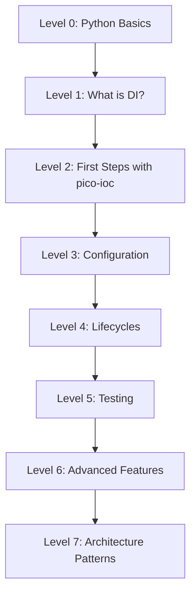

# Learning Roadmap

This roadmap takes you from zero to advanced usage of **pico-ioc**.

## Roadmap Overview



---

## Level 0: Prerequisites

What you need to know before starting: Basic Python (3.11+)

### 1. Classes and inheritance

```python
class Animal:
    def __init__(self, name: str):
        self.name = name

    def speak(self) -> str:
        return "..."

class Dog(Animal):
    def speak(self) -> str:
        return f"{self.name} says: Woof!"
```

### 2. Type hints (critical for DI)

```python
from typing import Protocol

class Sender(Protocol):
    def send(self, msg: str) -> None: ...

class EmailSender:
    def send(self, msg: str) -> None:
        print(f"[EMAIL] {msg}")
```

> Why this matters: **pico-ioc** resolves dependencies using type annotations.

---

## Level 1: What is Dependency Injection?

**The problem:** when a class creates its own dependencies, it becomes tightly coupled and hard to test.

```python
# Without DI: class creates its own dependency
class Notifier:
    def __init__(self):
        self._sender = EmailSender()  # hardcoded

    def notify(self, text: str) -> None:
        self._sender.send(text)
```

**The solution:** receive dependencies from outside (inject them).

```python
# With DI: dependency is injected
class Notifier:
    def __init__(self, sender: Sender):
        self._sender = sender

    def notify(self, text: str) -> None:
        self._sender.send(text)
```

Now `Notifier` works with any `Sender` implementation: `EmailSender`, `SmsSender`, or a `FakeSender` in tests. This is the core idea behind Inversion of Control (IoC): the class doesn't control how its dependencies are created.

An **IoC container** like pico-ioc automates this wiring. You declare what each class needs, and the container builds the full object graph for you.

---

## Level 2: First Steps with pico-ioc

### The three core APIs

| API | Purpose |
|-----|---------|
| `@component` | Registers a class with the container |
| `init(modules=[...])` | Scans modules, validates wiring, builds the container |
| `container.get(T)` | Resolves and returns a fully-wired instance of `T` |

### Hello World

```python
from pico_ioc import component, init

@component
class GreeterService:
    def greet(self) -> str:
        return "Hello, pico-ioc!"

@component
class App:
    def __init__(self, greeter: GreeterService):  # auto-injected
        self.greeter = greeter

    def run(self):
        print(self.greeter.greet())

if __name__ == "__main__":
    container = init(modules=[__name__])
    app = container.get(App)
    app.run()  # "Hello, pico-ioc!"
```

### Registering third-party classes

Use `@factory` + `@provides` when you can't decorate a class:

```python
import redis
from pico_ioc import factory, provides

@factory
class InfraFactory:
    @provides(redis.Redis)
    def build_redis(self) -> redis.Redis:
        return redis.Redis.from_url("redis://localhost")
```

See [Getting Started](./getting-started.md) for the complete 5-minute tutorial.

---

## Level 3: Configuration

### Environment-based configuration

```python
from dataclasses import dataclass
from pico_ioc import configured, configuration, init, EnvSource

@configured(prefix="DB_")
@dataclass
class DBConfig:
    host: str = "localhost"
    port: int = 5432

# Reads DB_HOST, DB_PORT from environment
container = init(modules=[__name__], config=configuration())
```

### Tree-based configuration (YAML/JSON)

```python
from pico_ioc import configured, configuration, init
from pico_ioc.config_builder import FileSource

@configured(prefix="database", mapping="tree")
@dataclass
class DBConfig:
    host: str = "localhost"
    port: int = 5432

container = init(
    modules=[__name__],
    config=configuration(FileSource("config.yaml"))
)
```

See [Configuration (Basic)](./user-guide/configuration-basic.md) and [Configuration Binding](./user-guide/configuration-binding.md).

---

## Level 4: Lifecycles

### Scopes

| Scope | Behavior |
|-------|----------|
| `singleton` (default) | One instance for the container's lifetime |
| `prototype` | New instance on every `get()` call |
| `request` | One instance per request scope activation |
| `session` | One instance per session scope activation |
| `transaction` | One instance per transaction scope activation |

```python
@component(scope="prototype")
class RequestHandler:
    ...  # new instance every time
```

### Lifecycle hooks

```python
from pico_ioc import component, configure, cleanup

@component
class ConnectionPool:
    @configure
    def start(self):
        self.pool = create_pool()  # called after __init__

    @cleanup
    def close(self):
        self.pool.close()  # called on container.shutdown()
```

### Lazy instantiation

```python
@component(lazy=True)
class HeavyService:
    ...  # created only on first access, not at init()
```

See [Scopes, Lifecycle & Lazy](./user-guide/scopes-lifecycle.md).

---

## Level 5: Testing

Pico-ioc makes testing easy by design. Use `overrides` to replace any component:

```python
class FakeRepo:
    def fetch(self):
        return "test-data"

def test_service():
    container = init(
        modules=["myapp"],
        overrides={Repo: FakeRepo()}
    )
    svc = container.get(Service)
    assert svc.repo.fetch() == "test-data"
```

Use `profiles` to activate test-specific components:

```python
@component(profiles=["test"])
class TestDatabase:
    ...  # only registered when "test" profile is active

container = init(modules=["myapp"], profiles=["test"])
```

Since pico-ioc uses constructor injection exclusively, you can also test without the container at all:

```python
def test_notifier():
    fake = FakeSender()
    n = Notifier(sender=fake)
    n.notify("hello")
    assert fake.messages == ["hello"]
```

See [Testing](./user-guide/testing.md).

---

## Level 6: Advanced Features

### AOP Interceptors

Add cross-cutting concerns (logging, caching, security) without modifying business logic:

```python
from pico_ioc import component, intercepted_by, MethodInterceptor, MethodCtx

@component
class LogInterceptor(MethodInterceptor):
    def invoke(self, ctx: MethodCtx, call_next):
        print(f"Calling {ctx.name}")
        result = call_next(ctx)
        print(f"Done {ctx.name}")
        return result

@component
class Service:
    @intercepted_by(LogInterceptor)
    def process(self):
        return "result"
```

### Event Bus

Decouple components with publish/subscribe:

```python
from pico_ioc import Event, subscribe, component

class OrderCreated(Event):
    def __init__(self, order_id: str):
        self.order_id = order_id

@component
class EmailNotifier:
    @subscribe(OrderCreated)
    async def on_order(self, event: OrderCreated):
        print(f"Sending email for order {event.order_id}")
```

### Collection injection

```python
from typing import List, Dict

@component
class Router:
    def __init__(self, handlers: List[Handler]):  # all Handler implementations
        self.handlers = handlers

@component
class Registry:
    def __init__(self, services: Dict[str, Service]):  # keyed by name
        self.services = services
```

See [Advanced Features](./advanced-features/README.md).

---

## Level 7: Architecture Patterns

At this level, you use pico-ioc as the backbone for full application architecture:

- **CQRS**: Separate command/query handlers with `Dict[Type, Handler]` injection
- **Multi-tenant**: Use `scope="request"` with per-tenant configuration
- **Feature toggles**: Use AOP interceptors to enable/disable features at runtime
- **Structured logging**: Attach request context via interceptors
- **Hot-reload configuration**: Watch config files and refresh the container

See the [Cookbook](./cookbook/README.md) for complete, runnable examples of each pattern.

---

## FAQ

**If a component only requests `Sender`, how does the container know which one to inject?**
Mark one binding as **primary** via `primary=True`. See [Conditional binding](./advanced-features/conditional-binding.md).

**Can I use pico-ioc with FastAPI/Flask?**
Yes. See [pico-fastapi](https://github.com/dperezcabrera/pico-fastapi) for automatic integration including request scope management.

**What if I have circular dependencies?**
pico-ioc detects them at startup and raises an error. Break the cycle using `@configure` methods or `lazy=True`. See [ADR-008](./adr/adr-0008-circular-dependencies.md).
