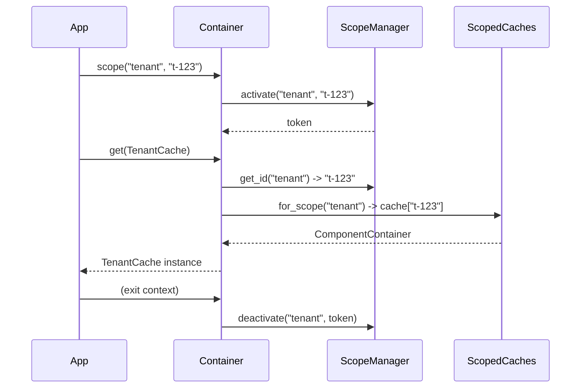

# How to Create and Use Custom IoC Scopes

## Problem

You need component instances tied to a lifecycle that is not covered by the
built-in scopes (`singleton`, `prototype`, `request`, `session`, `websocket`,
`transaction`).  For example, you want a **tenant** scope where each tenant
gets its own isolated set of service instances.

## Solution

### 1. Register the scope at init time

Pass the custom scope name to `init(custom_scopes=[...])`.  pico-ioc
automatically creates a `ContextVarScope` for it:

```python
from pico_ioc import init, component

@component(scope="tenant")
class TenantCache:
    def __init__(self):
        self.data: dict = {}

container = init(
    modules=[__name__],
    custom_scopes=["tenant"],
)
```

### 2. Activate the scope around your work

Use `container.scope(name, scope_id)` as a context manager.  All
resolutions inside the block share the same scope instance:

```python
with container.scope("tenant", tenant_id):
    cache = container.get(TenantCache)   # per-tenant instance
    cache.data["key"] = "value"

# A different tenant gets a different instance:
with container.scope("tenant", other_tenant_id):
    other_cache = container.get(TenantCache)
    assert other_cache is not cache
```

### 3. Clean up when a scope ends

When a scope is no longer needed (e.g. the tenant disconnects), clean up
its cached instances explicitly:

```python
container._caches.cleanup_scope("tenant", tenant_id)
```

This invokes all `@cleanup` methods on components stored under that scope ID.

## Explanation

Under the hood, each custom scope gets its own `contextvars.ContextVar`.
When you call `container.scope("tenant", "t-123")`, pico-ioc:

1. Sets the context variable to `"t-123"`.
2. On `container.get(TenantCache)`, the container looks up the scope from
   `ProviderMetadata`, asks `ScopeManager.get_id("tenant")` for the current
   ID (`"t-123"`), and stores/retrieves the instance in a per-scope-ID cache.
3. On exiting the `with` block, the context variable is reset.



## Common Pitfalls

| Pitfall | Fix |
|---------|-----|
| **Forgetting `custom_scopes`** at `init()` time causes a `ScopeError` at resolution. | Always pass `custom_scopes=["tenant"]` to `init()`. |
| **Resolving a scoped component outside its context** raises `ScopeError: No active scope ID found`. | Wrap the resolution in `container.scope(...)`. |
| **Using reserved names** (`singleton`, `prototype`) raises `ScopeError: Cannot register reserved scope`. | Choose a different name. |
| **Memory leaks** from never cleaning up old scope IDs. | Call `cleanup_scope()` when the scope ends, or use `ScopedCaches.shrink()` for bounded eviction. |
| **Scope promotion** -- a singleton depending on a scoped component gets its scope automatically promoted. | This is intentional; see the internals docs on `_promote_scopes`. |
