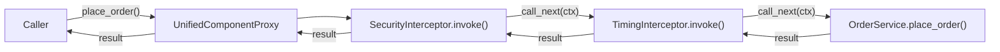

# How to Create and Chain Method Interceptors

## Problem

You want to add cross-cutting behaviour -- logging, security checks, caching,
retry logic -- to specific methods on your components without modifying their
business logic.

## Solution

### 1. Create an interceptor component

An interceptor is a `@component` that implements the `MethodInterceptor`
protocol: a single `invoke(ctx, call_next)` method.

```python
import time
from pico_ioc import component, MethodCtx, MethodInterceptor

@component
class TimingInterceptor:
    """Measures and logs method execution time."""

    def invoke(self, ctx: MethodCtx, call_next) -> object:
        start = time.perf_counter()
        result = call_next(ctx)
        elapsed_ms = (time.perf_counter() - start) * 1000
        print(f"{ctx.cls.__name__}.{ctx.name} took {elapsed_ms:.1f}ms")
        return result
```

### 2. Apply the interceptor to methods

Use `@intercepted_by(InterceptorClass)` on the methods you want to
intercept:

```python
from pico_ioc import component, intercepted_by

@component
class OrderService:
    @intercepted_by(TimingInterceptor)
    def place_order(self, order_id: str) -> str:
        # business logic
        return f"Order {order_id} placed"
```

### 3. Chain multiple interceptors

Pass multiple interceptor classes.  They execute **in the order listed**,
wrapping around each other:

```python
@component
class SecurityInterceptor:
    def invoke(self, ctx: MethodCtx, call_next):
        if not ctx.kwargs.get("user"):
            raise PermissionError("Unauthenticated")
        return call_next(ctx)

@component
class OrderService:
    @intercepted_by(SecurityInterceptor, TimingInterceptor)
    def place_order(self, order_id: str, user: str = "") -> str:
        return f"Order {order_id} placed by {user}"
```

Execution order:

```
SecurityInterceptor.invoke()
  -> TimingInterceptor.invoke()
    -> OrderService.place_order()   (the real method)
```

### 4. Async interceptors

Interceptors work with both sync and async methods.  For async methods, the
interceptor chain is awaited automatically:

```python
@component
class RetryInterceptor:
    async def invoke(self, ctx: MethodCtx, call_next):
        for attempt in range(3):
            try:
                result = call_next(ctx)
                if hasattr(result, "__await__"):
                    result = await result
                return result
            except Exception:
                if attempt == 2:
                    raise
```

## Explanation

When a component has `@intercepted_by` on any method, the container wraps
the entire component in a `UnifiedComponentProxy`.  On each method call:

1. The proxy detects the interceptor classes from `_pico_interceptors_`.
2. It resolves each interceptor class from the container (they are components
   themselves).
3. `dispatch_method()` builds a chain: each `call_next` invocation calls the
   next interceptor, and the final `call_next` calls the real method.
4. Wrapped methods are cached per scope signature to avoid repeated setup.



### The MethodCtx object

Every interceptor receives a `MethodCtx` with:

| Attribute | Description |
|-----------|-------------|
| `ctx.instance` | The real component instance |
| `ctx.cls` | The component's class |
| `ctx.method` | The bound method being called |
| `ctx.name` | Method name (string) |
| `ctx.args` | Positional arguments |
| `ctx.kwargs` | Keyword arguments |
| `ctx.container` | The owning `PicoContainer` |
| `ctx.local` | Mutable dict for sharing data between interceptors |
| `ctx.request_key` | The active scope ID (e.g. request ID) |

## Common Pitfalls

| Pitfall | Fix |
|---------|-----|
| **Forgetting to call `call_next(ctx)`** -- the real method never executes. | Always call `call_next(ctx)` unless you intentionally short-circuit. |
| **Interceptor is not a `@component`** -- the container cannot resolve it. | Add `@component` to the interceptor class. |
| **Applying `@intercepted_by` to the class** instead of individual methods. | `@intercepted_by` decorates *methods*, not classes. |
| **Modifying `ctx.args`/`ctx.kwargs` without care** -- can break the method signature. | If you modify arguments, create a new `MethodCtx` or update in place. |
| **Async interceptor on sync method** raises `RuntimeError`. | Ensure sync methods only have sync interceptors, or guard with `asyncio.iscoroutinefunction`. |
| **Circular dependencies** -- interceptor depends on the component it intercepts. | Factor out the dependency or use `lazy=True`. |
